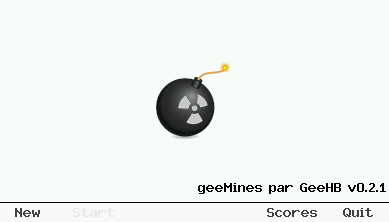
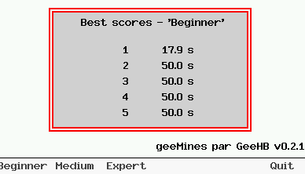
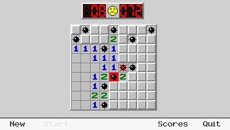
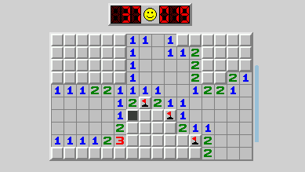
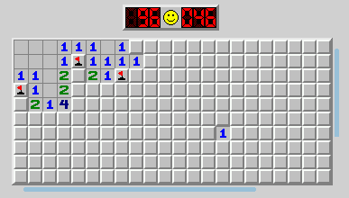
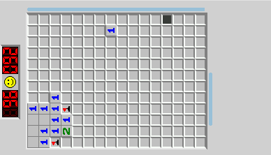

## *geeMines* - Un jeu de *démineur* pour Casio GRAPH90+E / FX-CG50

### Présentation

*`geeMines`* est un jeu de démineur développé en C avec `gint`.

3 niveaux sont possibles : Débutant (matrice 9 x 9 avec 10 mines),  Moyen (matrice 16 x 16 avec 40 mines) et expert (16 x 30 pour 99 mines).

L'utilisateur a la possibilité de 'tourner' la calculatrice et d'utiliser un affichage horizontal.

Il est (très) librement inspiré de 2 projets :
* [reactos::minesweeper](https://github.com/reactos/reactos/tree/master/base/applications/games/winmine)
* [WininMine-Source-for-Teaching](https://www.codeproject.com/Articles/183582/Adapted-WinMine-Source-for-Teaching-Win32-API-Prog)

### Informations de version

| Dépôt              | https://gitea.planet-casio.com/Jhb/geeMines      |
| ------------------ | ------------------------------------------------ |
| **Date**           | 2 avril 2025                                     |
| **Version stable** | **0.2.1** - branche `main`                       |
| **Dépendances**    | **Casio / gint**                                 |
| **Testé sur**      | *Linux* (Fedora 41) avec `code::blocks` et *Zed* |
|                    | *Casio Graph90+E*                                |

### Copies d'écran

|     |     |
| --- | --- |
|     |     |
|     |     |
|     |     |

### Utilisation du clavier

La partie se joue à l'aide des touches suivantes :

| Touche              | Action                                                                                     |
| ----------------------------------------------------------- | -------------------------------------------------- |
| | Déplacement du curseur dans la grille |
|                                     | Ajout / Suppression d'un **drapeau** à l'emplacement courant |
|                                   | Ajout / Suppression d'une **question** à l'emplacement courant|
|                                     | Tentative de mettre en pied sur la case courante. Si cette case contient une mine la partie est terminée.|
|  | **Sortie** du jeu et retour au menu principal. La partie est considérée comme perdue |

Les boutons de contrôles permettent de changer le comportement du jeu :

| Touche | Action                                                                      |
|--------|-----------------------------------------------------------------------------|
|  | **Changement du mode d'affichage**. Par défaut l'affichage est en mode vertical (calculatrice en mode normal), un appui transformera instantanément les affichages du jeu vers le mode horizontal et inversement à l'appui suivant.|
|  | **Pause** du jeu :  une image d'écran factice est affichée. Lorsque l'on appuie à nouveau sur la touche, le jeu reprend son cours.|
|  | Activation du **transfert des affichages** par *USB* (transfert à l'utilitaire `fxlink` par exemple). Cette fonction est active lorsque les sources ont été  compilés avec l'option de compilation ***SCREEN_CAPTURE***.|

