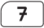
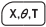
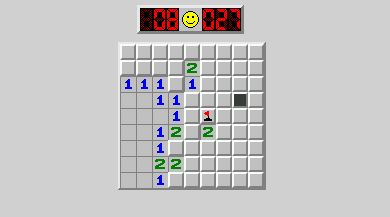
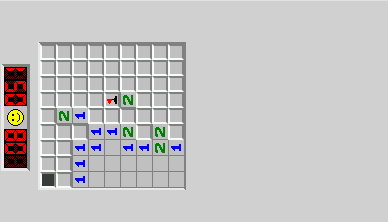
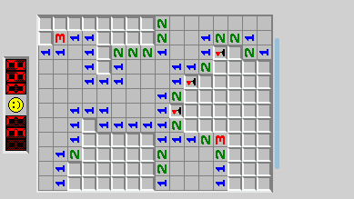
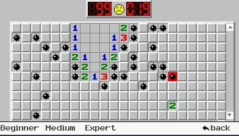

## *geeMines* - Un jeu de *démineur* pour les Casio GRAPH90+E / FX-CG50 et GRAPH35+E ii

### Présentation

`geeMines` est un jeu ...  utilisant `gint`.

Il offre différentes options : affichage de l'ombre de la pièce, démarrage avec un handicap de lignes 'sales', démarrage sur un niveau plus rapide.
Il permet aussi de jouer avec la calculatrice en mode horizontal (position standard) ou en mode vertical.

basé sur :
projet pédagogique : https://www.codeproject.com/Articles/183582/Adapted-WinMine-Source-for-Teaching-Win32-API-Prog
https://github.com/reactos/reactos/tree/master/base/applications/games/winmine
https://minesweeper.online/fr/game/4289190080

### Informations de version

| Dépôt          | https://gitea.planet-casio.com/Jhb/geeMines     |
|----------------|--------------------------------------------------|
| **Date**           | xx mars 2025                                      |
| **Version stable** | **0.2.1** - branche `dev`                             |
| **Dépendances**    | **Casio / gint**                                     |
| **Testé sur**      | *Linux* (Fedora 41) avec `code::blocks` et *Zed*              |
|                | *Casio Graph90+E*  et Casio Grapg35+E ii avec `gint` |

### Utilisation du clavier

#### A partir du menu principal

L'application se présente sous la forme d'onglets associés aux touches de contrôle. Les différents onglets permettent soit de modifier les paramètres de l'application soit de lancer l'application :

|                    Touches                             | Action                                                                                                                                                                                        |
|--------------------------------------------------------|-----------------------------------------------------------------------------------------------------------------------------------------------------------------------------------------------|
|                                                  | Affichage de l'**écran d'accueil**                                                                                                                                                                |
|                                                  | Choix du **niveau de départ**. Plus le niveau est important et plus les pièces tomberont rapidement mais plus les lignes complètes raporteront de points. Par défaut le jeu commence au niveau 1. |
|                                                  | Choix du **nombre de lignes 'sales'** affichées au démarrage de la partie. Par défaut il n'y a aucune ligne sur l'écran.                                                                          |
|                                                  | Affichage de **l'ombre de la pièce**. En l'absence d'ombre les lignes complètes raporteront plus de points. Les ombres sont affichées par défaut.                                                 |
|                                                  | **Lancement** d'une partie avec les paramètres sélectionnés.                                                                                                                                      |
|                                                  | **Sortie** de l'application.                                                                                                                                                                      |
|                                            | Modification de la valeur du paramètre dans les onglets *Level* et *Lines*.                                                                                                                       |
|                                            | Activation / désactivation de la **capture** (communication avec `fxlink`). Il faut le programme soit compilé en mode *TRACE*.                                                                        |
|                                            | Affichage du tableau des scores.                                                                                                                                                              |

**Attention** L'activation du mode *capture* peut bloquer la calculatrice.

#### Pendant la partie ...

Quel que soit le mode d'affichage choisi, vertical ou horizontal, les touches suivantes fonctionneront à l'identique à tout moment de la partie :

| Touche | Action                                                                                                                                                                                                                                                                                                                                                                                               |
|--------|------------------------------------------------------------------------------------------------------------------------------------------------------------------------------------------------------------------------------------------------------------------------------------------------------------------------------------------------------------------------------------------------------|
|  | **Changement du mode d'affichage**. Par défaut l'affichage est en mode horizontal (calculatrice en mode normal), un appui transformera instantanément les affichages du jeu vers le mode vertical. Compte tenu des dimensions de l'écran, en mode vertical les pièces peuvent être plus  larges. Le jeu est assurément plus jouable. Réciproquement suite à un second appui, il retourna au mode normal. |
|  | Pause du jeu (Graph90+E seulement). En mode **pause**, une image d'écran factice est affichée. Lorsque l'on appuie à nouveau sur la touche, le jeu reprend son cours.                                                                                                                                                                                                                                    |
|  | **Sortie** du jeu et retour au menu principal.                                                                                                                                                                                                                                                                                                                                                           |

#### Contrôles en mode horizontal

| Touche | Action                                     |
|--------|--------------------------------------------|
|  | Déplacement de la pièce vers la **gauche**     |
|  | Déplacement de la pièce vers la **droite**     |
|  | **Descente** de la pièce d'un rang             |
|  | **Rotation** de la pièce                       |
|  | Faire **tomber** la pièce le plus bas possible |

#### Contrôles en mode vertical

Les contrôles "suivent" le mouvement de la calculatrice :

| Touche | Action                                     |
|--------|--------------------------------------------|
|  | Déplacement de la pièce vers la **gauche**     |
|  | Déplacement de la pièce vers la **droite**     |
|  | **Descente** de la pièce d'un rang             |
|  | **Rotation** de la pièce                       |
|  | Faire **tomber** la pièce le plus bas possible |

### Copies d'écran

Ecran d'accueil :

Grilles :

